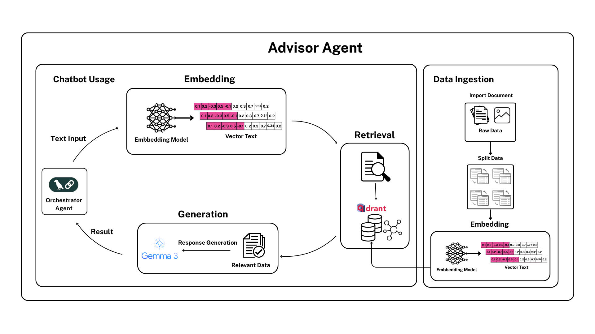

# Hệ thống Hỏi-Đáp Tài liệu PDF sử dụng LangGraph, RAG và Qdrant

Một hệ thống thông minh có khả năng hiểu câu hỏi của người dùng và trả lời dựa trên nội dung của các tài liệu PDF được cung cấp. Hệ thống tận dụng sức mạnh của LangGraph để điều phối các tác vụ, kỹ thuật RAG để kết hợp truy xuất thông tin với khả năng sinh văn bản, và Qdrant làm cơ sở dữ liệu vector.

**🆕 Kiến trúc mới: Tách biệt Data Ingestion + Chatbot Class**  
**📁 Sử dụng thư mục `data/` mặc định**

## 🏗️ Kiến trúc hệ thống

### Kiến trúc Tách biệt (Mới)



1. **📥 Data Ingestion Script** (`ingest_data.py`)
   - Xử lý PDF từ thư mục `data/` → Embedding → Vector DB
   - Chỉ chạy khi có dữ liệu mới
   - Independent pipeline

2. **🤖 Chatbot Class** (`chatbot.py`)  
   - Query Processing → RAG → Response
   - Method `invoke()` cho mỗi chat
   - Production-ready

### Các thành phần chính

- **LangGraph**: Điều phối workflow và quản lý trạng thái
- **RAG (Retrieval Augmented Generation)**: Truy xuất thông tin + sinh câu trả lời
- **Qdrant**: Cơ sở dữ liệu vector để lưu trữ và tìm kiếm
- **Sentence Transformers**: Mô hình embedding
- **Google Gemini**: Mô hình ngôn ngữ lớn (thay thế OpenAI GPT)

### Workflow

#### Giai đoạn 1: Data Ingestion (script - một lần)
```bash
# Đặt PDF vào data/ và chạy
python ingest_data.py
```
1. **Tải và phân tách PDF** → Chia thành chunks
2. **Tạo embeddings** → Chuyển text thành vectors
3. **Lưu vào Qdrant** → Lập chỉ mục vectors

#### Giai đoạn 2: Chatbot Usage (class - mỗi query)
```python
result = chatbot.invoke("Câu hỏi của tôi")
```
1. **Xử lý câu hỏi** → Tạo query embedding
2. **Truy xuất tài liệu** → Tìm chunks liên quan
3. **Đánh giá và lọc** → Chọn nội dung chất lượng
4. **Tổng hợp ngữ cảnh** → Kết hợp thông tin
5. **Tạo câu trả lời** → Sử dụng Google Gemini

## 📦 Cài đặt

### 1. Yêu cầu hệ thống

- Python 3.8+
- Qdrant server (local hoặc cloud)
- Google API key (Gemini)

### 2. Cài đặt dependencies

```bash
pip install -r requirements.txt
```

### 3. Cấu hình môi trường

#### Lấy Google API Key:
1. Truy cập https://makersuite.google.com/app/apikey
2. Tạo API key mới
3. Copy API key

#### Tạo file `.env` hoặc export biến môi trường:

```bash
export GOOGLE_API_KEY="your_google_api_key_here"
export GEMINI_MODEL="gemini-1.5-flash"  # hoặc gemini-1.5-pro
export QDRANT_URL="http://localhost:6333"
export QDRANT_API_KEY=""  # Tùy chọn nếu dùng Qdrant Cloud
```

### 4. Khởi động Qdrant server

```bash
# Sử dụng Docker
docker run -p 6333:6333 qdrant/qdrant

# Hoặc sử dụng docker-compose
docker-compose up -d
```

## 🚀 Sử dụng (Đơn giản với thư mục data/)

### 1. Setup lần đầu

```bash
# Hướng dẫn setup từng bước
python main.py setup
```

### 2. Quy trình nhanh (3 bước)

```bash
# Bước 1: Đặt PDF vào thư mục data
mkdir data
cp your_files.pdf data/

# Bước 2: Nạp dữ liệu
python ingest_data.py

# Bước 3: Sử dụng chatbot
python main.py demo
```

### 3. Cấu trúc thư mục data

```
data/
├── research_papers/
│   ├── paper1.pdf
│   └── paper2.pdf
├── manuals/
│   ├── user_guide.pdf
│   └── technical_spec.pdf
└── reports/
    └── annual_report.pdf
```

### 4. Commands chính

```bash
# Data ingestion
python ingest_data.py              # Nạp từ data/
python ingest_data.py --clear      # Xóa dữ liệu cũ
python ingest_data.py --check      # Kiểm tra hệ thống

# Chatbot usage
python main.py demo                # Demo với câu hỏi mẫu
python main.py interactive         # Chat tương tác
python main.py check               # Kiểm tra trạng thái
python main.py setup               # Hướng dẫn setup
```

### 5. Sử dụng trong code

```python
from chatbot import create_chatbot

# Tạo chatbot instance
chatbot = create_chatbot()

# Invoke method cho mỗi query
result = chatbot.invoke("Tài liệu này nói về gì?")

if result["status"] == "success":
    print(f"Trả lời: {result['answer']}")
    print(f"Nguồn: {result['sources']}")
else:
    print(f"Lỗi: {result['error']}")
```

## 📁 Cấu trúc dự án

```
advisor_agent/
├── data/                         # 📁 Thư mục chứa PDF files
│   ├── .gitkeep                  # Keep folder trong git
│   └── your_files.pdf            # Đặt PDF ở đây
├── ingest_data.py                # 📥 Script nạp dữ liệu PDF
├── chatbot.py                    # 🤖 Chatbot class với invoke method
├── main.py                       # 🚀 Main application
├── agents/
│   ├── __init__.py
│   └── rag_agent.py              # Agent xử lý RAG với Gemini
├── utils/
│   ├── __init__.py
│   ├── pdf_processor.py          # Xử lý PDF
│   ├── embedding_manager.py      # Quản lý embeddings
│   └── qdrant_manager.py         # Quản lý Qdrant
├── workflow/
│   ├── __init__.py
│   └── langgraph_workflow.py     # LangGraph workflow (legacy)
├── config.py                     # Cấu hình hệ thống
├── requirements.txt              # Dependencies
├── USAGE.md                      # 📖 Hướng dẫn chi tiết
├── document.md                   # Tài liệu workflow gốc
└── README.md                     # Hướng dẫn này
```

## ⚙️ Ưu điểm Kiến trúc Mới

### 🔄 Tách biệt Concerns
- **Data Ingestion**: Xử lý PDF độc lập từ thư mục `data/`
- **Query Processing**: Chatbot class chuyên dụng  
- **Performance**: Không load PDF processing mỗi lần chat

### 🚀 Production Ready
- **Modular**: Dễ maintain và scale
- **Efficient**: Load model một lần, sử dụng nhiều lần
- **Flexible**: Có thể integrate vào web API, CLI, notebook

### 💻 Developer Friendly
- **Simple API**: `chatbot.invoke(query)`
- **Rich Response**: Status, sources, metadata
- **Error Handling**: Graceful error recovery
- **Monitoring**: Health check, stats

### 📁 Data Management
- **Default Folder**: Thư mục `data/` mặc định
- **Auto Discovery**: Tự động tìm PDF trong subfolders
- **Easy Setup**: Copy PDF vào data/ và chạy script

## 🔧 Cấu hình

Chỉnh sửa `config.py` để tùy chỉnh:

```python
class Config:
    # Google Gemini API
    GOOGLE_API_KEY = "your_key"
    GEMINI_MODEL = "gemini-1.5-flash"  # hoặc gemini-1.5-pro
    
    # Database
    QDRANT_URL = "http://localhost:6333"
    
    # Models
    EMBEDDING_MODEL = "sentence-transformers/all-MiniLM-L6-v2"
    
    # Chunking
    CHUNK_SIZE = 1000
    CHUNK_OVERLAP = 200
    
    # Retrieval
    TOP_K_DOCUMENTS = 5
    SIMILARITY_THRESHOLD = 0.7
    
    # Gemini settings
    GEMINI_TEMPERATURE = 0.1
    GEMINI_MAX_OUTPUT_TOKENS = 2048
```

## 🤖 Google Gemini Models

### Các model có sẵn:
- **gemini-1.5-flash**: Nhanh, phù hợp cho hầu hết tác vụ
- **gemini-1.5-pro**: Chất lượng cao hơn, chậm hơn
- **gemini-1.0-pro**: Phiên bản cũ hơn

### Ưu điểm của Gemini:
- **Miễn phí**: API có quota miễn phí hào phóng
- **Đa ngôn ngữ**: Hỗ trợ tiếng Việt tốt
- **Context dài**: Hỗ trợ context window lớn
- **Hiệu suất**: Tốc độ response nhanh

## 💡 Ví dụ sử dụng

### 1. Web API Integration

```python
from fastapi import FastAPI
from chatbot import get_chatbot

app = FastAPI()
chatbot = get_chatbot()  # Singleton

@app.post("/chat")
async def chat(query: str):
    result = chatbot.invoke(query)
    return {
        "answer": result["answer"],
        "sources": result["sources"],
        "status": result["status"]
    }
```

### 2. CLI Application

```python
from chatbot import create_chatbot

chatbot = create_chatbot()

while True:
    query = input("Question: ")
    if query == 'exit':
        break
    
    result = chatbot.invoke(query)
    print(f"Answer: {result['answer']}")
```

### 3. Batch Processing

```python
questions = [
    "Vấn đề chính là gì?",
    "Phương pháp được sử dụng?",
    "Kết luận quan trọng?"
]

results = chatbot.batch_invoke(questions)
for q, r in zip(questions, results):
    print(f"Q: {q}\nA: {r['answer']}\n")
```

## 🛠️ API Reference

### DataIngestionPipeline (ingest_data.py)

#### Methods
- `run_ingestion(pdf_paths=None, clear_existing=False)`: Nạp dữ liệu PDF
- `check_prerequisites()`: Kiểm tra tiên quyết
- `check_data_folder()`: Kiểm tra thư mục data

#### Usage
```bash
python ingest_data.py              # Mặc định từ data/
python ingest_data.py path/        # Từ path cụ thể
python ingest_data.py --clear      # Xóa collection cũ
python ingest_data.py --check      # Chỉ kiểm tra
```

### PDFChatbot (chatbot.py)

#### Main Methods
- `invoke(query, **kwargs)`: Xử lý một câu hỏi
- `batch_invoke(queries, **kwargs)`: Xử lý nhiều câu hỏi
- `health_check()`: Kiểm tra sức khỏe
- `get_collection_stats()`: Thống kê collection

#### Invoke Parameters
- `query`: Câu hỏi (required)
- `top_k`: Số documents retrieve (optional)
- `similarity_threshold`: Ngưỡng similarity (optional)  
- `verbose`: In chi tiết quá trình (optional)

#### Response Format
```python
{
    "query": str,
    "answer": str,
    "sources": List[str],
    "relevant_docs_count": int,
    "total_retrieved_count": int,
    "status": str,  # "success" or "error"
    "error": str,   # nếu có lỗi
    "metadata": Dict
}
```

## 🔍 Troubleshooting

### 1. Lỗi thư mục data

```bash
# Tạo thư mục và đặt PDF
mkdir data
cp your_files.pdf data/

# Kiểm tra
python main.py check
```

### 2. Lỗi Collection rỗng

```bash
# Kiểm tra và nạp dữ liệu
python ingest_data.py --check
python ingest_data.py
```

### 3. Lỗi kết nối Qdrant

```bash
# Kiểm tra Qdrant đang chạy
curl http://localhost:6333/health
docker-compose ps

# Restart nếu cần
docker-compose restart
```

### 4. Lỗi Google Gemini API

```python
# Test trong code
from chatbot import create_chatbot
chatbot = create_chatbot()
health = chatbot.health_check()
print(health)
```

### 5. Setup từ đầu

```bash
# Chạy setup guide
python main.py setup
```

## 📊 Monitoring và Logging

### Logging Output
```
🔧 Khởi tạo Data Ingestion Pipeline...
✅ Tìm thấy 5 PDF files trong data/
📄 Bắt đầu xử lý 5 PDF files...
🧮 Tạo embeddings cho 150 documents...
💾 Lưu 150 documents vào Qdrant...
✅ Đã lưu thành công!

🤖 Khởi tạo PDF Chatbot...
📊 Collection ready: 150 vectors
✅ Chatbot đã sẵn sàng!
```

### Health Monitoring
```python
# Định kỳ check health
health = chatbot.health_check()
if health["status"] != "healthy":
    # Alert or restart
    print(f"Chatbot unhealthy: {health}")
```

## 🚀 Production Deployment

### 1. Environment Setup
```bash
# Production environment
export GOOGLE_API_KEY="production_key"
export GEMINI_MODEL="gemini-1.5-pro"
export QDRANT_URL="https://your-qdrant-cloud.com"
export QDRANT_API_KEY="production_qdrant_key"
```

### 2. Data Pipeline
```bash
# Batch job cho data ingestion
cron: 0 2 * * * /path/to/python ingest_data.py --clear
```

### 3. Application Integration  
```python
# Singleton trong production
from chatbot import get_chatbot

# Application startup
chatbot = get_chatbot()

# Request handling
def handle_request(user_query):
    return chatbot.invoke(user_query)
```

## 💰 Chi phí và Limits

### Google Gemini (miễn phí):
- **Gemini 1.5 Flash**: 15 requests/minute, 1M tokens/day
- **Gemini 1.5 Pro**: 2 requests/minute, 50 requests/day

### So sánh với OpenAI:
| Feature | Google Gemini | OpenAI GPT |
|---------|---------------|------------|
| Cost | Miễn phí (có limit) | Trả phí theo usage |
| Speed | Nhanh | Trung bình |
| Vietnamese | Tốt | Rất tốt |
| Context | 32k - 2M tokens | 4k - 128k tokens |

## 📖 Tài liệu thêm

- **[USAGE.md](docs/USAGE.md)**: Hướng dẫn sử dụng chi tiết
- **[document.md](docs/document.md)**: Tài liệu workflow gốc
- **[EMBEDDING_GUIDE.md](docs/EMBEDDING_GUIDE.md)**: Hướng dẫn embedding, lựa chọn mô hình
- **[EYEWEAR_DOMAIN_GUIDE.md](docs/EYEWEAR_DOMAIN_GUIDE.md)**: Hướng dẫn tối ưu hóa cho domain mắt kính
- **[EYEWEAR_DOMAIN_GUIDE.md](docs/EYEWEAR_DOMAIN_GUIDE.md)**: Hướng dẫn tối ưu hóa cho domain mắt kính
- **[README_A2A.md](docs/README_A2A.md)**: Tài liệu A2A cho advisor agent


## 📜 License

MIT License

## 🤝 Contributing

1. Fork repository
2. Tạo feature branch
3. Commit changes
4. Push và tạo Pull Request

## 📞 Support

Nếu gặp vấn đề, hãy:
1. Chạy `python main.py setup` để kiểm tra
2. Kiểm tra logs chi tiết
3. Tham khảo Troubleshooting
4. Xem USAGE.md
5. Tạo issue trên GitHub

---

**Tác giả**: AI Assistant  
**Phiên bản**: 3.1.0 (Data Folder Architecture)  
**Cập nhật**: 2024

**🔗 Quick Start:**
1. 📁 `mkdir data && cp *.pdf data/`
2. 📥 `python ingest_data.py`
3. 🤖 `python main.py demo`

**📖 Chi tiết:** [USAGE.md](USAGE.md) 