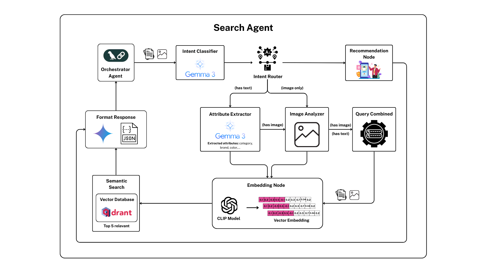

# 🔍 Search Agent

Agent tìm kiếm sản phẩm kính mắt thông minh sử dụng giao thức A2A (Agent-to-Agent) với khả năng tìm kiếm đa phương thức.

## ✨ Tính năng

- 📝 **Tìm kiếm bằng văn bản**: Xử lý câu truy vấn ngôn ngữ tự nhiên của người dùng
- 🖼️ **Tìm kiếm bằng hình ảnh**: Phân tích hình ảnh kính mắt để tìm kiếm sản phẩm tương tự
- 🔄 **Tìm kiếm kết hợp**: Kết hợp thông tin từ cả văn bản và hình ảnh
- 👤 **Tư vấn sản phẩm**: Đề xuất kính mắt phù hợp với nhu cầu cụ thể

## 🧠 Kiến trúc hệ thống


Search Agent được xây dựng theo kiến trúc đồ thị trạng thái (StateGraph) từ LangGraph, với 9 node chính:

1. **🎯 Intent Classifier**: Xác định ý định của người dùng từ câu truy vấn
2. **🔀 Intent Router**: Định tuyến luồng xử lý dựa trên ý định và loại input
3. **🔍 Attribute Extraction**: Trích xuất thuộc tính sản phẩm từ câu truy vấn
4. **📷 Image Analysis**: Phân tích hình ảnh để trích xuất thông tin về kính mắt
5. **🔗 Query Combiner**: Kết hợp thông tin từ phân tích văn bản và hình ảnh
6. **🧮 Embed Query**: Chuyển đổi query thành vector embedding
7. **🔎 Semantic Search**: Thực hiện tìm kiếm ngữ nghĩa trên Qdrant
8. **📊 Format Response**: Định dạng kết quả tìm kiếm thành phản hồi thân thiện
9. **💡 Recommendation**: Đưa ra tư vấn về sản phẩm kính mắt phù hợp

## 🛠️ Công nghệ sử dụng

- **🔄 LangGraph & LangChain**: Framework xây dựng luồng công việc dạng đồ thị
- **🤖 Google Gemini**: Mô hình ngôn ngữ lớn (LLM) cho phân tích và sinh nội dung
- **🖼️ CLIP**: Mô hình đa phương thức cho tìm kiếm kết hợp văn bản-hình ảnh
  - Sử dụng mô hình CLIP tùy chỉnh (CLIP_FTMT.pt) được fine-tune cho kính mắt
- **🔍 Qdrant**: Vector database cho tìm kiếm ngữ nghĩa
- **⚡ FastAPI**: Framework API RESTful hiệu năng cao

## 📖 Tài liệu chi tiết

- **[README_A2A.md](docs/README_A2A.md)**: Tài liệu A2A cho advisor agent
- **[system.md](docs/system.md)**: Tài liệu chi tiết hệ thống search agent

## 🚀 Cài đặt

```bash
# Cài đặt các thư viện phụ thuộc
pip install -r requirements.txt
```

## 📋 Cấu hình môi trường

```
GOOGLE_API_KEY=your_google_api_key
QDRANT_HOST=localhost
QDRANT_PORT=6333
CLIP_MODEL_PATH=../models/clip/CLIP_FTMT.pt
```

## 💻 Sử dụng

### Chạy agent

```bash
python run_server.py
```

### Sử dụng client để tương tác với agent

```bash
# Chế độ tương tác
python client.py chat

# Chế độ demo với các câu hỏi mẫu
python client.py demo

# Gửi câu hỏi trực tiếp
python client.py "Tôi cần một cặp kính râm chống UV"
```

### 🖼️ Tìm kiếm bằng hình ảnh

Có hai cách để tìm kiếm sản phẩm bằng hình ảnh:

#### 1. Sử dụng chế độ tương tác

Trong chế độ tương tác (`python client.py chat`), bạn có thể sử dụng lệnh `image` để gửi hình ảnh:

```
image <đường_dẫn_đến_ảnh> [mô_tả_tùy_chọn]
```

Ví dụ:
```
image /path/to/glasses.jpg Tôi muốn tìm kính giống mẫu này
```

#### 2. Sử dụng công cụ kiểm tra tìm kiếm ảnh

```bash
python image_search_test.py /path/to/image.jpg -d "Mô tả về ảnh" -u http://localhost:10002
```

Tham số:
- Đường dẫn đến file ảnh (bắt buộc)
- `-d`, `--description`: Mô tả về ảnh (tùy chọn)
- `-u`, `--url`: URL của agent (mặc định: http://localhost:10002)

## 🔄 Luồng xử lý

### Tìm kiếm bằng văn bản

```
[Văn bản đầu vào] → Intent Classifier → Intent Router → Attribute Extractor → Embed Query → Semantic Search → Format Response → [Kết quả]
```

### Tìm kiếm bằng hình ảnh

```
[Hình ảnh đầu vào] → Intent Router → Image Analyzer → Embed Query → Semantic Search → Format Response → [Kết quả]
```

### Tìm kiếm kết hợp (văn bản + hình ảnh)

```
[Văn bản + Hình ảnh] → Intent Classifier → Intent Router → Attribute Extractor → Image Analyzer → Query Combiner → Embed Query → Semantic Search → Format Response → [Kết quả]
```

### Tư vấn sản phẩm

```
[Văn bản đầu vào] → Intent Classifier → Intent Router → Recommendation Node → [Kết quả]
```

## 📊 Cấu trúc message trong A2A

Khi gửi tin nhắn có hình ảnh, client sẽ tạo một message với nhiều parts:

```json
{
  "message": {
    "role": "user",
    "parts": [
      {
        "kind": "text",
        "text": "Mô tả về ảnh"
      },
      {
        "kind": "file",
        "file": {
          "name": "image.jpg",
          "mimeType": "image/jpeg",
          "bytes": "base64_encoded_data"
        }
      }
    ],
    "messageId": "unique_id"
  }
}
```

## 📂 Cấu trúc thư mục

```
search_agent/
├── a2a_wrapper/          # Wrapper cho A2A protocol
│   └── a2a_agent_executor.py
├── agent/                # Core agent logic
│   └── agent.py
├── chains/               # LangGraph chains
│   └── search_graph.py
├── nodes/                # LangGraph nodes
│   ├── intent_classifier_node.py
│   ├── attribute_extraction_node.py
│   ├── image_analysis_node.py
│   └── ...
├── api/                  # API endpoints
├── models/               # Mô hình CLIP tùy chỉnh
│   └── clip/
│       └── CLIP_FTMT.pt
├── client.py             # A2A client
├── image_search_test.py  # Tool to test image search
├── run_server.py         # A2A server
└── README.md
```

## 🚀 Phát triển tiếp theo

- 📱 Hỗ trợ tìm kiếm từ thiết bị di động
- 🌐 Tích hợp với các nền tảng thương mại điện tử
- 🔄 Cải thiện khả năng phân tích hình ảnh
- 🎯 Tối ưu hóa độ chính xác của tìm kiếm ngữ nghĩa
- 🧠 Bổ sung các mô hình AI tiên tiến