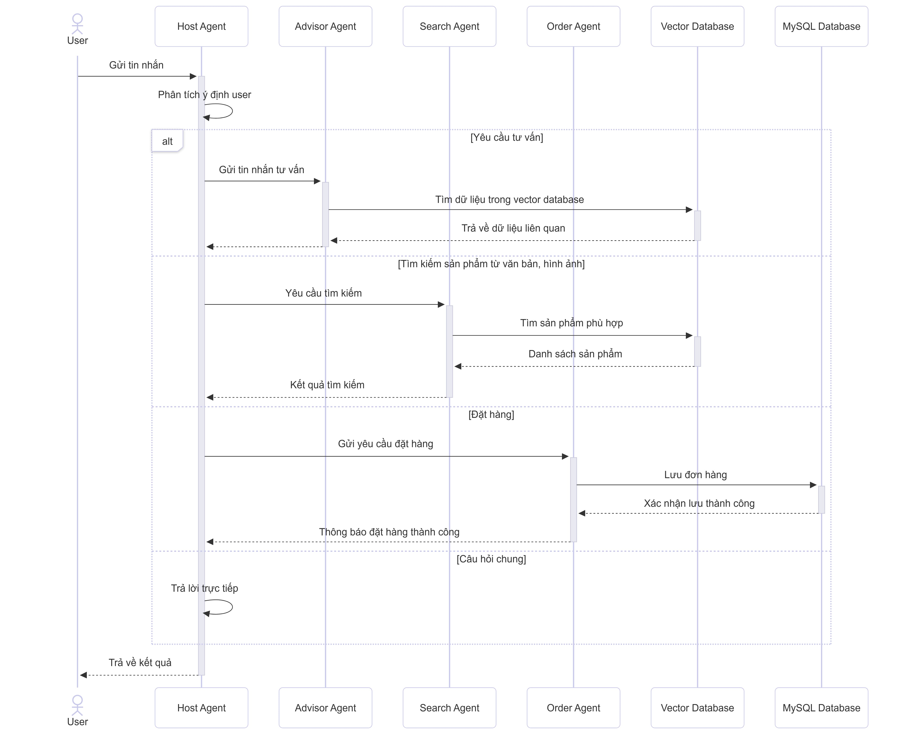

  

## KHÓA LUẬN TỐT NGHIỆP

-    **Đề tài:** XÂY DỰNG HỆ THỐNG CHATBOT HỖ TRỢ MUA SẮM MẮT KÍNH TRỰC
TUYẾN SỬ DỤNG MÔ HÌNH NGÔN NGỮ LỚN VÀ KỸ THUẬT TĂNG
CƯỜNG TRUY XUẤT
-    **Tên tiếng anh:** BUILDING A CHATBOT SYSTEM TO SUPPORT ONLINE EYEWEAR
SHOPPING USING LARGE LANGUAGE MODELS AND RETRIEVAL
AUGMENTED GENERATION

## THÀNH VIÊN NHÓM

| STT | MSSV     | Họ và Tên            | GitHub                            | Email                  |
| :-- | :------- | :------------------- | :-------------------------------- | :--------------------- |
| 1   | 21521990 | Nguyễn Dương         | https://github.com/duonguwu       | 21521990@gm.uit.edu.vn |
| 2   | 21521936 | Hoàng Mạnh Thắng       | https://github.com/mthangit       | 21521428@gm.uit.edu.vn |

## TỔNG QUAN HỆ THỐNG

EyeVi là hệ thống chatbot hỗ trợ mua sắm mắt kính trực tuyến sử dụng mô hình ngôn ngữ lớn (LLM) kết hợp với kỹ thuật Retrieval Augmented Generation (RAG) và mô hình CLIP để tìm kiếm sản phẩm đa phương thức. Hệ thống được thiết kế theo kiến trúc multi-agent, với mỗi agent đảm nhận một vai trò chuyên biệt trong quy trình mua sắm.

### Kiến trúc hệ thống

  

Hệ thống EyeVi bao gồm các thành phần chính:
- **Orchestrator Agent**: Điều phối luồng làm việc giữa các agent
- **Search Agent**: Tìm kiếm sản phẩm mắt kính bằng văn bản hoặc hình ảnh
- **Advisor Agent**: Tư vấn lựa chọn mắt kính phù hợp với người dùng
- **Order Agent**: Xử lý và theo dõi đơn hàng
- **Vector Database**: Lưu trữ và tìm kiếm embeddings của sản phẩm
- **MySQL Database**: Lưu trữ thông tin sản phẩm, đơn hàng và người dùng

### Sơ đồ tuần tự của hệ thống

  

## CẤU TRÚC DỰ ÁN

Dự án được tổ chức thành các thư mục chính:

### EyeVi_Agent

Thư mục chứa mã nguồn cho hệ thống multi-agent, bao gồm các agent chuyên biệt để tìm kiếm, tư vấn và xử lý đơn hàng mắt kính.

- **[README.md](EyeVi_Agent/README.md)**: Hướng dẫn chi tiết về hệ thống agent
- **[DOCKER.md](EyeVi_Agent/DOCKER.md)**: Hướng dẫn triển khai với Docker

### eyevi_ui

Thư mục chứa mã nguồn giao diện người dùng (UI) của hệ thống, được phát triển với Next.js và Tailwind CSS.

- **[README.md](eyevi_ui/README.md)**: Hướng dẫn về giao diện người dùng
- **[src/](eyevi_ui/src/)**: Mã nguồn chính của giao diện

## CÔNG NGHỆ SỬ DỤNG

### 🧠 Backend (EyeVi_Agent)

#### 🔧 Ngôn ngữ và Framework
- **Python 3.13**: Ngôn ngữ lập trình chính
- **FastAPI**: Framework API RESTful hiệu năng cao
- **Uvicorn**: ASGI server

#### 🤖 Mô hình AI
- **Google Gemini**: Mô hình ngôn ngữ lớn (LLM) cho phân tích và tạo phản hồi
- **CLIP**: Mô hình đa phương thức cho tìm kiếm kết hợp văn bản-hình ảnh

  
📊 Kết quả fine-tuning mô hình CLIP

  
  | Cấu hình mô hình | Recall@1 | Recall@5 | MAP | Mean Cosine Similarity |
  | :---------------- | :--------------------: | :------: | :------: | :-: |
  | CLIP gốc (ViT-B/32) | 0.044 | 0.123 | 0.029 | 0.247 |
  | LP + CLIP Loss gốc | 0.1896 | 0.5452 | 0.1591 | 0.2301 |
  | LP + 0.5·L2 | 0.1985 | 0.5568 | 0.1642 | 0.2217 |
  | LP + 0.5·L2 + 0.3·L3 | 0.1422 | 0.4237 | 0.1241 | 0.2383 |
  | LP + 0.5·L2 + 0.3·L3 + 0.1·L4 | 0.2133 | 0.5748 | 0.1752 | 0.2273 |
  | Multi-layer + CLIP Loss gốc | 0.1881 | 0.517 | 0.1293 | 0.2152 |
  | Multi-layer + 0.5·L2 | **0.2548** | **0.6281** | 0.1723 | 0.2316 |
  | Multi-layer + 0.5·L2 + 0.3·L3 | 0.2237 | 0.5541 | 0.1808 | **0.2439** |
  | Multi-layer + 0.5·L2 + 0.3·L3 + 0.1·L4 | 0.2548 | 0.5881 | **0.1952** | 0.240 |

- **Embedding Models**: `intfloat/multilingual-e5-base` tối ưu cho tiếng Việt

#### 🗄️ Cơ sở dữ liệu
- **Qdrant**: Vector database cho tìm kiếm ngữ nghĩa
- **MySQL**: Lưu trữ thông tin sản phẩm và đơn hàng

#### 🔄 Framework Multi-Agent
- **LangGraph**: Xây dựng luồng công việc dạng đồ thị
- **LangChain**: Kết nối LLM với nguồn dữ liệu
- **A2A Protocol**: Giao tiếp giữa các agent

#### 📚 Kỹ thuật RAG
- Kết hợp truy xuất thông tin với khả năng sinh văn bản
- Chunking và xử lý tài liệu tối ưu cho domain mắt kính

### 🎨 Frontend (eyevi_ui)

#### 🔧 Framework và Ngôn ngữ
- **Next.js 15**: Framework React hiện đại
- **React 19**: Thư viện JavaScript UI
- **TypeScript**: JavaScript với kiểu tĩnh

#### 💅 UI và Styling
- **Tailwind CSS**: Framework CSS utility-first
- **shadcn/ui**: Components UI có thể tùy chỉnh
- **Lucide Icons**: Bộ icon đơn giản

#### 💬 Tính năng
- Giao diện chat trực quan
- Đính kèm tệp và hình ảnh
- Chụp ảnh từ camera
- Ghi âm giọng nói

### 🚀 DevOps

- **Docker & Docker Compose**: Container hóa và triển khai
- **Bash Scripts**: Tự động hóa quy trình

### 🔍 Tối ưu hóa cho Domain Mắt kính

- Từ khóa chuyên ngành: tình trạng thị lực, loại tròng kính, kiểu gọng
- Tối ưu hóa tìm kiếm: ngưỡng tương đồng 0.68, top-k 8 kết quả

